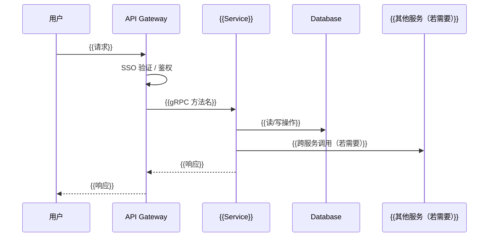
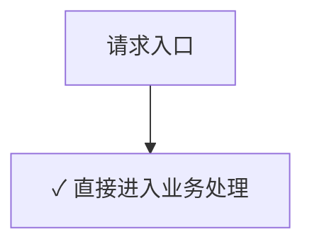

**项目名称**：{{PROJECT_NAME}}
**文档类型**：Design — API 类（同步请求/响应）
**服务名称**：{{SERVICE_NAME}}
**创建日期**：{{YYYY-MM-DD}}
**创建人**：{{AUTHOR}}
**审核人**：{{REVIEWER}}
**版本号**：v1.0
**状态**：草稿

| 版本号 | 修订日期 | 修订人 | 修订内容 | 审核人 |
|--------|----------|--------|----------|--------|
| v1.0 | {{YYYY-MM-DD}} | {{AUTHOR}} | 初稿创建 | {{REVIEWER}} |

---

## 1. 概述

{{一句话说明本服务/模块的本次设计范围。项目级全局视角见 HLD 文档，本文档聚焦具体接口设计。}}

**关键约束**（来自 PRD + ADR，不可改）：
- {{ADR-0001: ...}}
- {{ADR-0002: ...}}

**技术栈**（从 `architecture/` 读取，若不存在则来自采访）：
- 后端框架：{{Vert.x / Spring Boot / Micronaut / ...}}
- 数据库：{{MariaDB / PostgreSQL / Cloud Spanner / ...}}
- 服务间通信：{{gRPC / REST / ...}}
- 部署：{{Kubernetes / ...}}
- 其他：{{SSO / 鉴权 / ...}}

**文档边界**：本文档只描述 {{SERVICE_NAME}} 的同步 API 入口部分。{{若该服务还含定时任务或异步消费，提示「其他入口请见 xxx_design_v1.0_*.md」}}

## 2. 数据模型

{{先用一段话或一个简短列表说明本服务涉及哪些核心业务实体、各干啥，让读者看 ER 图前先有业务印象。}}

**实体说明**：
- {{Entity1}}：{{一句话说明这个实体在业务里代表什么，如"员工记录，首次 SSO 登录时懒同步创建"}}
- {{Entity2}}：{{一句话说明}}

{{再用 mermaid erDiagram 一次画完：实体名 + 关键字段 + 关系 + 基数。
只列关键字段（PK / FK / 核心业务字段），不写完整 DDL（DDL 级在 detail design 阶段）。}}

```mermaid
erDiagram
    {{ENTITY1}} {
        {{bigint}} {{id}} PK
        {{string}} {{field1}}
        {{string}} {{field2}}
    }
    {{ENTITY2}} {
        {{bigint}} {{id}} PK
        {{bigint}} {{entity1_id}} FK
        {{int}} {{field3}}
    }
    {{ENTITY1}} ||--o{ {{ENTITY2}} : "{{has}}"
    {{ENTITY3}} ||--o{ {{ENTITY1}} : "{{references}}"
```

## 3. 本次范围

{{说明本次 HLD 涵盖哪些同步 API。HLD 是 feature 级文档，不是服务全量清单——
首次开发时可能涵盖所有接口，后续新 feature 只写本次涉及的接口。}}

**本次涉及的接口**：

| 接口名 | 协议 | 方法/路径 | 一句话说明 |
|---|---|---|---|
| {{SendAppreciation}} | {{gRPC}} | {{SendAppreciation}} | {{发送赞赏}} |
| {{GetReceivedList}} | {{gRPC}} | {{GetReceivedList}} | {{查收到的赞赏列表}} |
| {{...}} | {{...}} | {{...}} | {{...}} |

## 4. 接口处理时序图

{{按接口分小节。每个接口画自己的 sequenceDiagram，体现该接口的完整处理链路：
谁调本服务 → 本服务调谁（DB / 其他服务）→ 返回。
不展开校验细节（校验在 §5 按接口分小节描述），只画主路径的成功流程。}}

### {{接口名1}}

{{一句话说明这个接口的处理链路。}}



### {{接口名2}}

{{同上格式。即使处理简单也要画时序图，体现完整的调用链路。}}

## 5. 关键校验与错误码

### 5.1 校验规则

{{按接口分小节。每个对外暴露的接口都要有自己的校验规则小节，含校验规则表 + 校验顺序流程图。
即使校验简单（如纯查询接口）也要列出，不能省略。}}

#### {{接口名1}}

**校验规则表**：

| # | 校验点 | 触发条件 | 拒绝原因 |
|---|---|---|---|
| 1 | {{校验点1}} | {{触发条件}} | {{拒绝原因}} |
| 2 | {{校验点2}} | {{触发条件}} | {{拒绝原因}} |

**校验顺序流程图**：

```mermaid
flowchart TD
    Start[请求入口] --> V1{{校验点1描述}}
    V1 -->|通过| V2{{校验点2描述}}
    V1 -->|不通过| E1[返回 {{ERROR_CODE_1}}]
    V2 -->|通过| OK[✓ 通过,进入业务处理]
    V2 -->|不通过| E2[返回 {{ERROR_CODE_2}}]
```

#### {{接口名2}}

{{同上格式：校验规则表 + 校验顺序流程图。即使无校验也要注明"无业务校验，直接处理"。}}

**校验规则表**：

| # | 校验点 | 触发条件 | 拒绝原因 |
|---|---|---|---|
| - | 无业务校验 | - | - |

**校验顺序流程图**：



### 5.2 错误码清单

{{每个校验规则对应的错误码 + HTTP/gRPC code。REST 接口填 HTTP 状态码列，gRPC 接口填 gRPC code 列，按技术栈选其一。}}

| 错误码 | 触发条件 | HTTP 状态码 | gRPC code |
|---|---|---|---|
| {{SELF_APPRECIATION}} | {{giver_id == receiver_id}} | {{400 / 422}} | {{FAILED_PRECONDITION}} |
| {{QUOTA_EXCEEDED}} | {{超出剩余配额}} | {{422}} | {{FAILED_PRECONDITION}} |
| {{RECEIVER_NOT_FOUND}} | {{接收者本地记录不存在}} | {{404}} | {{NOT_FOUND}} |
| {{CATEGORY_INACTIVE}} | {{分类已下线}} | {{422}} | {{FAILED_PRECONDITION}} |
| {{...}} | {{...}} | {{...}} | {{...}} |

**错误码命名规范**：
- 全大写 + 下划线分隔，如 `QUOTA_EXCEEDED`
- 业务错误用业务语义命名（如 `SELF_APPRECIATION`，不用 `VALIDATION_ERROR`）
- 通用错误用通用命名（如 `UNAUTHORIZED` / `FORBIDDEN` / `NOT_FOUND`）
