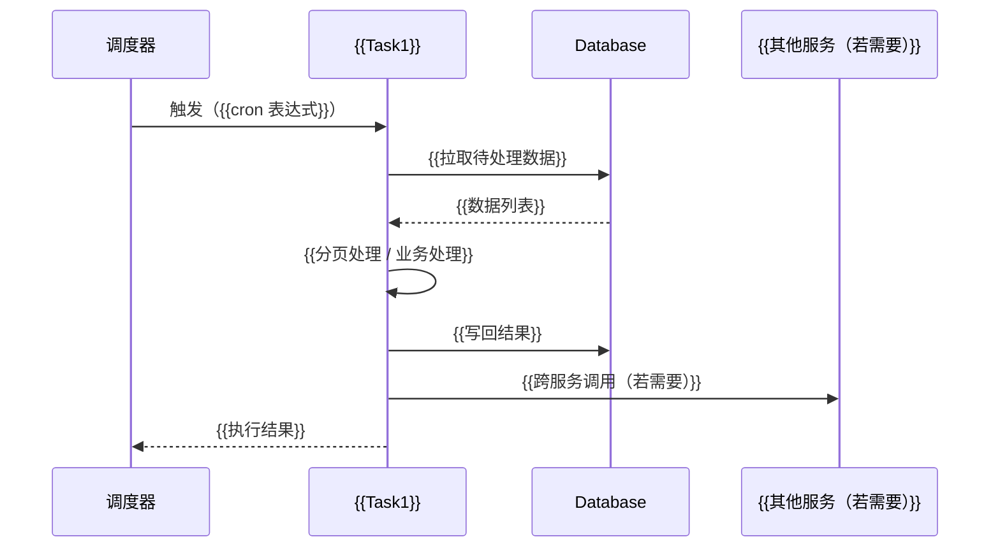
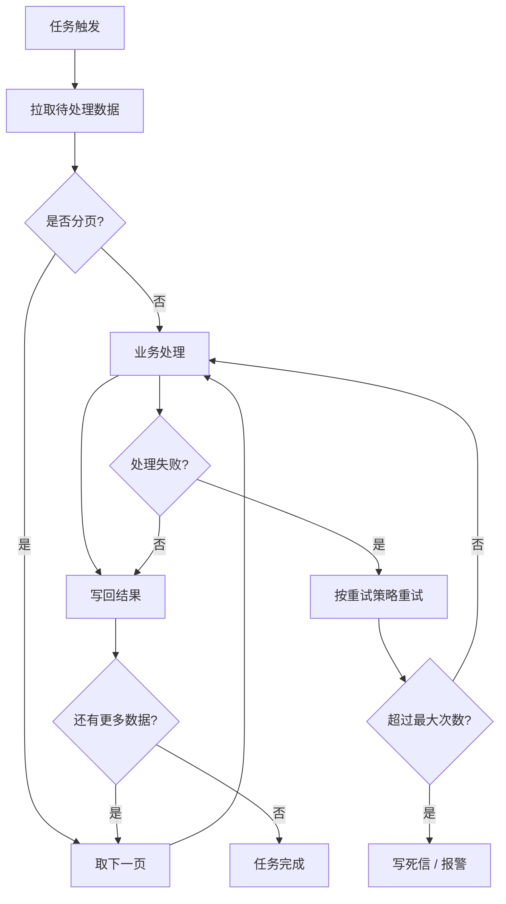

**项目名称**：{{PROJECT_NAME}}
**文档类型**：Design — Batch 类（定时批处理）
**服务名称**：{{SERVICE_NAME}}
**创建日期**：{{YYYY-MM-DD}}
**创建人**：{{AUTHOR}}
**审核人**：{{REVIEWER}}
**版本号**：v1.0
**状态**：草稿

| 版本号 | 修订日期 | 修订人 | 修订内容 | 审核人 |
|--------|----------|--------|----------|--------|
| v1.0 | {{YYYY-MM-DD}} | {{AUTHOR}} | 初稿创建 | {{REVIEWER}} |

---

## 1. 概述

{{一句话说明本服务/模块的本次设计范围。项目级全局视角见 HLD 文档，本文档聚焦具体任务设计。}}

**关键约束**（来自 PRD + ADR，不可改）：
- {{ADR-0001: ...}}
- {{ADR-0002: ...}}

**技术栈**（从 `architecture/` 读取，若不存在则来自采访）：
- 后端框架：{{Vert.x / Spring Boot / Micronaut / ...}}
- 数据库：{{MariaDB / PostgreSQL / Cloud Spanner / ...}}
- 定时任务调度：{{xxl-job / Quartz / Spring Scheduler / ...}}
- 部署：{{Kubernetes / ...}}
- 其他：{{...}}

**文档边界**：本文档只描述 {{SERVICE_NAME}} 的定时批处理任务部分。{{若该服务还含同步 API 或异步消费，提示「其他入口请见 xxx_design_v1.0_*.md」}}

## 2. 数据模型

{{先用一段话或一个简短列表说明本服务涉及的哪些核心业务实体、各干啥，让读者看 ER 图前先有业务印象。
批处理任务通常操作已有实体（不新建表），所以这里列出的是被批处理读写的实体。}}

**实体说明**：
- {{Entity1}}：{{一句话说明这个实体在业务里代表什么}}
- {{Entity2}}：{{一句话说明}}

{{再用 mermaid erDiagram 一次画完：实体名 + 关键字段 + 关系 + 基数。
只列关键字段（PK / FK / 核心业务字段），不写完整 DDL（DDL 级在 detail design 阶段）。}}

```mermaid
erDiagram
    {{ENTITY1}} {
        {{bigint}} {{id}} PK
        {{string}} {{field1}}
        {{string}} {{field2}}
    }
    {{ENTITY2}} {
        {{bigint}} {{id}} PK
        {{bigint}} {{entity1_id}} FK
        {{int}} {{field3}}
    }
    {{ENTITY1}} ||--o{ {{ENTITY2}} : "{{has}}"
```

## 3. 本次范围

{{说明本次 HLD 涵盖哪些定时批处理任务。HLD 是 feature 级文档，不是服务全量清单——
首次开发时可能涵盖所有任务，后续新 feature 只写本次涉及的任务。}}

**本次涉及的任务**：

| 任务名 | 调度 | 一句话说明 |
|---|---|---|
| {{Task1}} | {{每天 00:00 北京时间}} | {{一句话说明这个任务干啥}} |
| {{Task2}} | {{每小时}} | {{...}} |

> 后续新 feature 增加的定时任务，走独立的 HLD，不在本文档追加。完整任务清单以服务级 HLD 或 architecture/ 为准。

{{§4-§7 按本次涉及的任务分小节展开。}}

## 4. 任务处理时序图

{{按任务分小节。每个任务画自己的 sequenceDiagram 或 flowchart，体现该任务的完整处理链路：
谁触发 → 本任务调谁（DB / 其他服务）→ 返回。
不展开校验细节（校验在 §5 按任务分小节描述），只画主路径的成功流程。}}

### {{Task1}}

{{一句话说明这个任务的处理链路。}}



### {{Task2}}

{{同上格式。即使处理简单也要画时序图，体现完整的调用链路。}}

## 5. 调度计划

{{按任务分小节。每个任务列出调度细节。}}

### {{Task1}}

| 维度 | 值 |
|---|---|
| cron 表达式 | {{0 0 0 * * ?}} |
| 触发频率 | {{每日}} |
| 时区 | {{Asia/Shanghai}} |
| 单次执行时长上限 | {{5 分钟}} |
| 是否可重入 | {{是 / 否}} |
| 错过触发时处理策略 | {{立即补执行 / 跳过 / 报警}} |

### {{Task2}}

{{同上格式。}}

## 6. 幂等与重试

{{按任务分小节。每个任务列出幂等键设计和失败重试策略。
批处理任务通常必须幂等（可能被重试或重复触发），幂等键是硬要求。}}

### {{Task1}}

**幂等设计**：

| 维度 | 说明 |
|---|---|
| 幂等键 | {{如 period_date + employee_id，或 batch_id}} |
| 幂等实现 | {{INSERT IGNORE / UPSERT / 先查后写}} |
| 重复执行结果 | {{描述重复执行后的数据状态，应与单次执行一致}} |

**重试策略**：

| 维度 | 说明 |
|---|---|
| 最大重试次数 | {{3 次}} |
| 退避策略 | {{固定间隔 / 指数退避}} |
| 重试间隔 | {{如 1 分钟 / 5 分钟 / 30 分钟}} |
| 死信处理 | {{超过重试次数后怎么办：报警 / 写死信表 / 人工介入}} |
| 部分失败处理 | {{某页失败是否影响其他页：继续 / 终止}} |

**批处理流程图**：



### {{Task2}}

{{同上格式：幂等设计 + 重试策略 + 批处理流程图。}}
