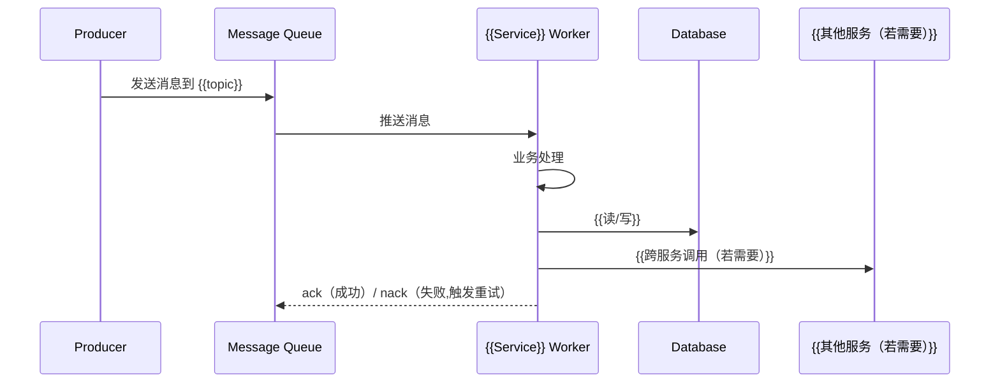
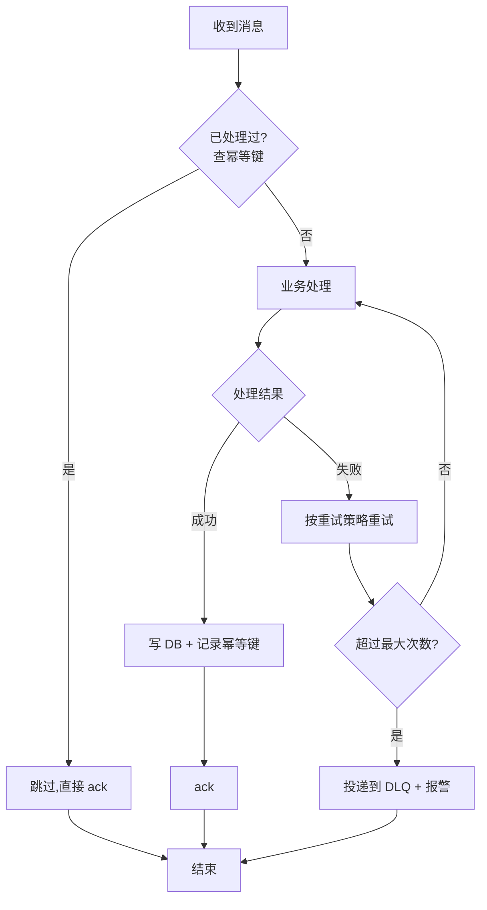

**项目名称**：{{PROJECT_NAME}}
**文档类型**：Design — Worker 类（异步消息消费者）
**服务名称**：{{SERVICE_NAME}}
**创建日期**：{{YYYY-MM-DD}}
**创建人**：{{AUTHOR}}
**审核人**：{{REVIEWER}}
**版本号**：v1.0
**状态**：草稿

| 版本号 | 修订日期 | 修订人 | 修订内容 | 审核人 |
|--------|----------|--------|----------|--------|
| v1.0 | {{YYYY-MM-DD}} | {{AUTHOR}} | 初稿创建 | {{REVIEWER}} |

---

## 1. 概述

{{一句话说明本服务/模块的本次设计范围。项目级全局视角见 HLD 文档，本文档聚焦具体订阅设计。}}

**关键约束**（来自 PRD + ADR，不可改）：
- {{ADR-0001: ...}}
- {{ADR-0002: ...}}

**技术栈**（从 `architecture/` 读取，若不存在则来自采访）：
- 后端框架：{{Vert.x / Spring Boot / Micronaut / ...}}
- 消息队列：{{Kafka / RabbitMQ / RocketMQ / ...}}
- 数据库：{{MariaDB / PostgreSQL / Cloud Spanner / ...}}
- 部署：{{Kubernetes / ...}}
- 其他：{{...}}

**文档边界**：本文档只描述 {{SERVICE_NAME}} 的异步消息消费部分。{{若该服务还含同步 API 或定时任务，提示「其他入口请见 xxx_design_v1.0_*.md」}}

## 2. 数据模型

{{先用一段话或一个简短列表说明本服务涉及的哪些核心业务实体、各干啥，让读者看 ER 图前先有业务印象。
Worker 通常消费消息后写入已有实体（不新建表），所以这里列出的是消费时读写的实体。}}

**实体说明**：
- {{Entity1}}：{{一句话说明这个实体在业务里代表什么}}
- {{Entity2}}：{{一句话说明}}

{{再用 mermaid erDiagram 一次画完：实体名 + 关键字段 + 关系 + 基数。
只列关键字段（PK / FK / 核心业务字段），不写完整 DDL（DDL 级在 detail design 阶段）。}}

```mermaid
erDiagram
    {{ENTITY1}} {
        {{bigint}} {{id}} PK
        {{string}} {{field1}}
        {{string}} {{field2}}
    }
    {{ENTITY2}} {
        {{bigint}} {{id}} PK
        {{bigint}} {{entity1_id}} FK
        {{int}} {{field3}}
    }
    {{ENTITY1}} ||--o{ {{ENTITY2}} : "{{has}}"
```

## 3. 本次范围

{{说明本次 HLD 涵盖哪些消息消费订阅。HLD 是 feature 级文档，不是服务全量清单——
首次开发时可能涵盖所有订阅，后续新 feature 只写本次涉及的订阅。}}

**本次涉及的消费订阅**：

| 订阅名 | MQ 主题 | 一句话说明 |
|---|---|---|
| {{Subscription1}} | {{topic1}} | {{一句话说明消费什么消息、做什么}} |
| {{Subscription2}} | {{topic2}} | {{...}} |
| {{...}} | {{...}} | {{...}} |

> 后续新 feature 增加的订阅，走独立的 HLD，不在本文档追加。

## 4. 消费处理时序图

{{按订阅分小节。每个订阅画自己的 sequenceDiagram，体现该订阅的完整处理链路：
producer → MQ → 本服务消费 → 调谁（DB / 其他服务）→ ack/nack。
不展开校验细节（在 §5 按订阅分小节描述），只画主路径的成功流程。}}

### {{Subscription1}}

{{一句话说明这个订阅的处理链路。}}



### {{Subscription2}}

{{同上格式。即使处理简单也要画时序图，体现完整的调用链路。}}

## 5. 消息模型与消费语义

{{按订阅分小节。每个订阅列出消息格式 + 消费语义。}}

### {{Subscription1}}

**消息模型**：

| 维度 | 说明 |
|---|---|
| MQ 类型 | {{Kafka / RabbitMQ / RocketMQ / ...}} |
| 主题/队列名 | {{topic name}} |
| 路由键/分区键 | {{routing key / partition key}} |
| 生产者来源 | {{哪个服务/系统产生消息}} |
| 消息格式 | {{JSON / protobuf / Avro}} |

**消息字段**（概要，完整 schema 在 detail design）：

| 字段 | 类型 | 必填 | 说明 |
|---|---|---|---|
| {{field1}} | {{string}} | 是 | {{说明}} |
| {{field2}} | {{int64}} | 是 | {{说明}} |
| {{field3}} | {{bool}} | 否 | {{说明}} |

**消费语义**：

| 维度 | 值 |
|---|---|
| 语义保证 | {{At-least-once / At-most-once / Exactly-once}} |
| 消费者组 | {{consumer group name}} |
| 并发度 | {{线程数 / 消费者实例数}} |
| offset/ack 提交策略 | {{处理后提交 / 处理前提交}} |
| 重复消费处理 | {{依赖幂等键（见 §6）}} |

### {{Subscription2}}

{{同上格式：消息模型 + 消费语义。}}

## 6. 幂等与重试

{{按订阅分小节。每个订阅列出幂等键设计和失败重试策略。
At-least-once 语义必有重复消费，幂等键是硬要求。}}

### {{Subscription1}}

**幂等设计**：

| 维度 | 说明 |
|---|---|
| 幂等键 | {{如 message_id / business_id + event_type}} |
| 幂等实现 | {{去重表 / UNIQUE 约束 / 版本号 / 状态机}} |
| 重复消费结果 | {{描述重复消费后的数据状态，应与单次消费一致}} |

**重试策略**：

| 维度 | 说明 |
|---|---|
| 最大重试次数 | {{3 次}} |
| 退避策略 | {{固定间隔 / 指数退避}} |
| 重试间隔 | {{如 1s / 10s / 1min}} |
| 死信队列（DLQ）| {{DLQ 主题名，超过重试次数后消息进入 DLQ}} |
| DLQ 处理 | {{报警 / 人工介入 / 补偿任务}} |

**消费处理流程图**：



### {{Subscription2}}

{{同上格式：幂等设计 + 重试策略 + 消费处理流程图。}}
