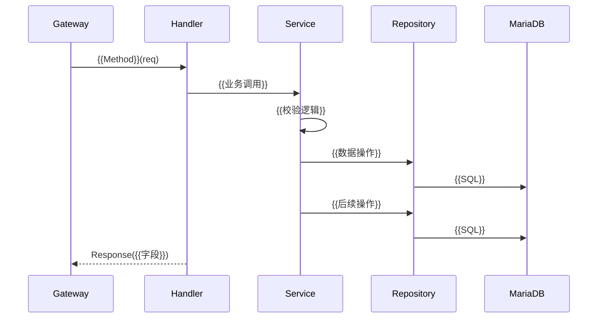

**项目名称**：{{PROJECT_NAME}}
**文档类型**：High Level Design — Feature 级
**创建日期**：{{YYYY-MM-DD}}
**创建人**：{{AUTHOR}}
**审核人**：{{REVIEWER}}
**版本号**：v1.0
**状态**：草稿

| 版本号 | 修订日期 | 修订人 | 修订内容 | 审核人 |
|--------|----------|--------|----------|--------|
| v1.0 | {{YYYY-MM-DD}} | {{AUTHOR}} | 初稿创建 | {{REVIEWER}} |

---

## 1. 概述

**Ticket**: {{TICKET_ID}}
{{一句话说明这个 feature 做什么。}}

**所属服务级 HLD**: {{服务级 HLD 文件名}}

## 2. 处理流程图

{{feature 的完整请求流转。最细,体现这个 feature 从入口到落库的每一步。}}



## 3. 数据模型

{{feature 涉及的表变更。新增/修改都列。}}

### 新增表:{{无 / table_name}}
| 字段 | 类型 | 约束 | 说明 |
|---|---|---|---|
| {{field}} | {{TYPE}} | {{约束}} | {{说明}} |

### 修改表:{{table_name}}
| 变更 | 字段 | 类型 | 说明 |
|---|---|---|---|
| 新增 | {{field}} | {{TYPE}} | {{说明}} |
| 修改 | {{field}} | {{旧}} → {{新}} | {{说明}} |

## 4. 接口设计

### 新增接口:{{无 / MethodName}}
```protobuf
rpc {{MethodName}}({{Request}}) returns ({{Response}});

message {{Request}} {
  {{type}} {{field}} = 1;
}
```

### 修改接口:{{MethodName}}
```protobuf
message {{Request}} {
  {{existing_field}} = 1;
  {{new_field}} = 2;  // 新增
}
```
