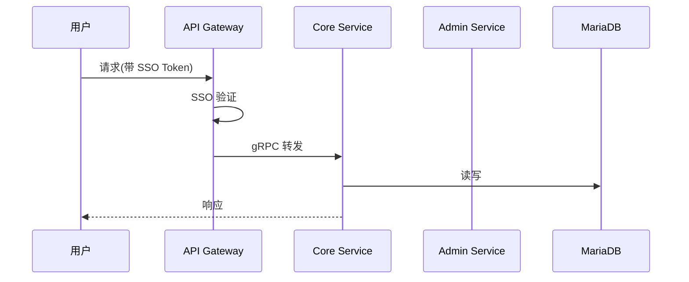

**项目名称**：{{PROJECT_NAME}}
**文档类型**：High Level Design — 项目级
**创建日期**：{{YYYY-MM-DD}}
**创建人**：{{AUTHOR}}
**审核人**：{{REVIEWER}}
**版本号**：v1.0
**状态**：草稿

| 版本号 | 修订日期 | 修订人 | 修订内容 | 审核人 |
|--------|----------|--------|----------|--------|
| v1.0 | {{YYYY-MM-DD}} | {{AUTHOR}} | 初稿创建 | {{REVIEWER}} |

---

## 1. 概述

{{一句话说明这个项目干啥。从 PRD §1 产品概述提炼,不超过 3 行。}}

**关键约束**(来自 PRD + ADR,不可改):
- {{ADR-0001: ...}}
- {{ADR-0002: ...}}

**技术栈**(来自 architecture/,若存在):
- {{后端框架 / 数据库 / 通信协议 / ...}}

## 2. 处理流程图

{{项目整体主流程,从用户触发到最终持久化。用 mermaid sequenceDiagram 或 flowchart。}}

## 3. 数据模型

{{项目整体逻辑数据模型。只列实体和关系,不到 DDL。}}

| 实体 | 所属服务 | 关键字段 | 关系 |
|---|---|---|---|
| {{Entity1}} | {{service}} | {{field1, field2}} | {{1:N Entity2}} |
| {{Entity2}} | {{service}} | {{field1, field2}} | {{N:1 Entity1}} |

## 4. 接口设计

{{项目级只列接口分类和归属服务,不到具体签名。}}

| 服务 | 暴露接口 | 消费接口 |
|---|---|---|
| {{API Gateway}} | {{REST /api/*}} | {{gRPC → core, admin}} |
| {{Core Service}} | {{gRPC: Method1, Method2}} | {{MariaDB}} |
| {{Admin Service}} | {{gRPC: Method1, Method2}} | {{MariaDB}} |
