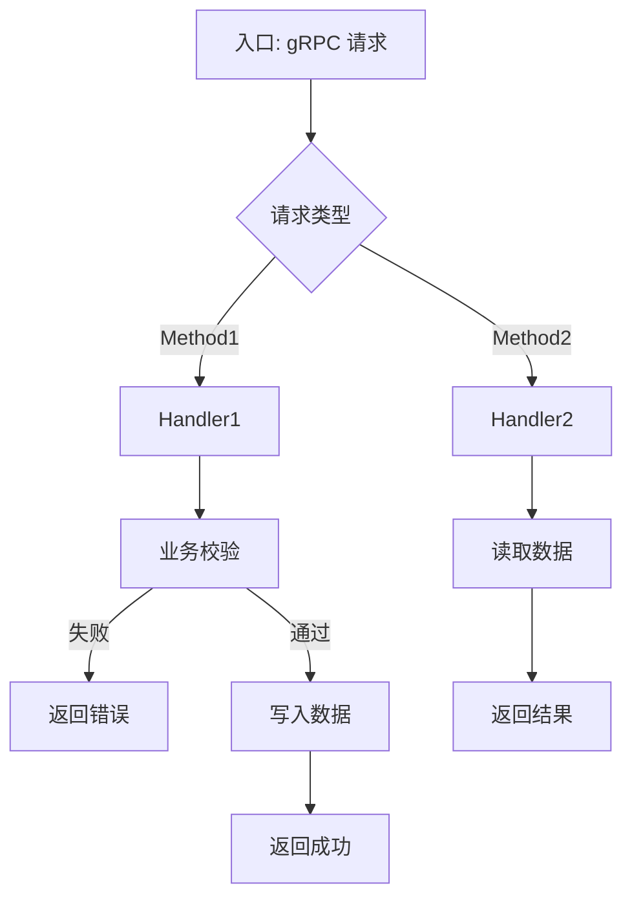

**项目名称**：{{PROJECT_NAME}}
**文档类型**：High Level Design — 服务级
**创建日期**：{{YYYY-MM-DD}}
**创建人**：{{AUTHOR}}
**审核人**：{{REVIEWER}}
**版本号**：v1.0
**状态**：草稿

| 版本号 | 修订日期 | 修订人 | 修订内容 | 审核人 |
|--------|----------|--------|----------|--------|
| v1.0 | {{YYYY-MM-DD}} | {{AUTHOR}} | 初稿创建 | {{REVIEWER}} |

---

## 1. 概述

{{本服务在整体流程中的角色。一句话。}}

**所属项目级 HLD**：{{项目级 HLD 文件名}}

**服务边界**:
- 对外暴露:{{gRPC 方法列表}}
- 对内消费:{{依赖的其他服务接口}}

## 2. 处理流程图

{{服务内部请求流转。比项目级更细,体现服务内的 handler / service / repository 层级。}}



## 3. 数据模型

{{本服务负责的表/字段。逻辑层,接近 DDL 但不到 DDL。}}

### 表:{{table_name}}
| 字段 | 类型 | 约束 | 说明 |
|---|---|---|---|
| id | BIGINT | PK, AUTO_INCREMENT | |
| {{field1}} | {{TYPE}} | {{NOT NULL / FK / ...}} | {{说明}} |
| created_at | DATETIME | NOT NULL, DEFAULT NOW | |

**索引**:{{idx_name (field1, field2)}}

## 4. 接口设计

### 4.X 对外暴露(gRPC)

#### {{MethodName}}

**说明**:{{一句话描述接口用途}}

**Request**:
```protobuf
message {{MethodRequest}} {
  {{type1}} {{field1}} = 1;  // {{必填/选填}} {{说明}}
  {{type2}} {{field2}} = 2;  // {{必填/选填}} {{说明}}
}
```

**Response**:
```protobuf
message {{MethodResponse}} {
  {{type1}} {{field1}} = 1;  // {{说明}}
}
```

**Error**:
| gRPC code | 错误码 | 触发条件 |
|---|---|---|
| INVALID_ARGUMENT | {{VALIDATION_ERROR}} | {{字段校验失败}} |
| NOT_FOUND | {{RESOURCE_NOT_FOUND}} | {{资源不存在}} |
| FAILED_PRECONDITION | {{BUSINESS_RULE_VIOLATION}} | {{业务规则违反}} |

### 4.Y 对内消费

| 目标 | 说明 |
|---|---|
| {{MariaDB / 其他服务}} | {{读写/调用说明}} |
