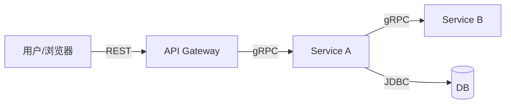

**项目名称**：{{PROJECT_NAME}}
**文档类型**：High Level Design（项目级）
**创建日期**：{{YYYY-MM-DD}}
**创建人**：{{AUTHOR}}
**审核人**：{{REVIEWER}}
**版本号**：v1.0
**状态**：草稿

| 版本号 | 修订日期 | 修订人 | 修订内容 | 审核人 |
|--------|----------|--------|----------|--------|
| v1.0 | {{YYYY-MM-DD}} | {{AUTHOR}} | 初稿创建 | {{REVIEWER}} |

---

## 1. 项目概述

{{一段话说明这个项目是什么、解决什么问题、面向谁。从 PRD 产品概述提炼，让读者不看其他文档就能理解项目背景。}}

**业务背景**：
{{为什么做这个项目？业务痛点是什么？解决后带来什么价值？}}

**关键约束**（来自 PRD + ADR，不可改）：
- {{ADR-0001: ...}}
- {{ADR-0002: ...}}

## 2. 整体架构图

{{画出整个系统的服务全景图——所有服务、它们之间的调用关系、数据流向。
用 mermaid graph，体现"谁调谁、数据怎么流"。
这张图是项目的"地图"，读者看完就知道系统有哪些组成部分、怎么协作。}}

```mermaid
graph TD
    U[用户] --> G[{{API Gateway}}]
    G -->|{{REST/gRPC}}| S1[{{Service1}}]
    G -->|{{REST/gRPC}}| S2[{{Service2}}]
    S1 -->|{{协议}}| DB1[({{Database1}})]
    S2 -->|{{协议}}| DB2[({{Database2}})]
    S1 -.->|{{协议}}| S2
    SCHED[{{调度器}}] -->|触发| S1
```

**图例说明**：
{{对图中的关键节点和连线做简要说明，如"实线=同步调用，虚线=异步/定时触发"。}}

## 3. 业务流程概览

> **本节的定位**：告诉读者"本次涉及哪些接口/任务，各干啥"。
> **不做**：不列具体校验规则、不画校验分支、不写错误码——这些在 Design §5 关键校验与错误码。
> **原因**：HLD 是项目级全景，规则/错误码是 detail design 的内容。混在这里会污染流程图，还会因规则变动频繁重画 HLD。

### 3.1 本次涉及的接口 / 任务清单

{{一个表格列出所有接口/任务，每个一句话说明"输入 → 主要处理 → 输出"，不展开校验细节。}}

| # | 名称 | 类型 | 所属服务 | 一句话说明 | 详细设计 |
|---|---|---|---|---|---|
| 1 | {{发送赞赏}} | api | {{core-service}} | {{Giver 提交给 Receiver 送 N 朵红花 → 业务校验 → 原子事务扣配额+写记录+更榜 → 返回确认}} | `feature/detail-design/<ticket>-*.md` |
| 2 | {{每日配额重置}} | batch | {{core-service}} | {{xxl-job 00:00 CT 触发 → 全员 period_quota 重置为默认配额 → 未用不结转}} | `feature/detail-design/<ticket>-*.md` |
| 3 | {{...}} | {{api/batch/worker}} | {{...}} | {{...}} | {{...}} |

### 3.2 跨服务编排图（可选，画极简版）

{{只在有跨服务调用编排需要说清楚时才画。图里只体现"哪个服务调哪个服务、走什么协议"，禁画任何判断分支。
如果一个接口从头到尾就在一个服务里跑完，本图可省略。}}



> 【禁】流程图里出现 `if 校验通过 / else 拒绝`、`Receiver 存在?`、`配额足够?` 这类判断节点。
> 有校验 → 用一个节点"业务校验（详见 Design §5）"带过，不展开。

## 4. 服务清单与定位

{{列出项目所有服务，每个服务一节说明定位。
按"入口类型"（api/batch/worker）分类描述——一个服务可能含多种入口类型。}}

### 4.1 {{Service1}}

| 维度 | 说明 |
|---|---|
| 服务名 | {{service-name}} |
| 核心职责 | {{一句话概括这个服务负责什么}} |
| 上游调用方 | {{如 API Gateway / 调度器 / MQ}} |
| 下游依赖 | {{如 MariaDB / 其他 gRPC 服务}} |
| 入口类型 | {{api / batch / worker，可多选}} |

**入口类型说明**：

- **API 入口**：{{同步请求/响应，一句话说明这个服务的 API 干啥}}。详细设计见 `feature/detail-design/<ticket>-*.md`
- **Batch 入口**：{{定时批处理，一句话说明这个服务的定时任务干啥}}。详细设计见 `feature/detail-design/<ticket>-*.md`
- **Worker 入口**：{{异步消息消费，一句话说明这个服务消费什么消息}}。详细设计见 `feature/detail-design/<ticket>-*.md`

> 只列出本服务实际有的入口类型，没有的删掉。

### 4.2 {{Service2}}

{{同上格式：服务名 + 核心职责 + 上游 + 下游 + 入口类型 + 入口类型说明。}}

### 4.3 {{...}}

{{同上格式。}}
