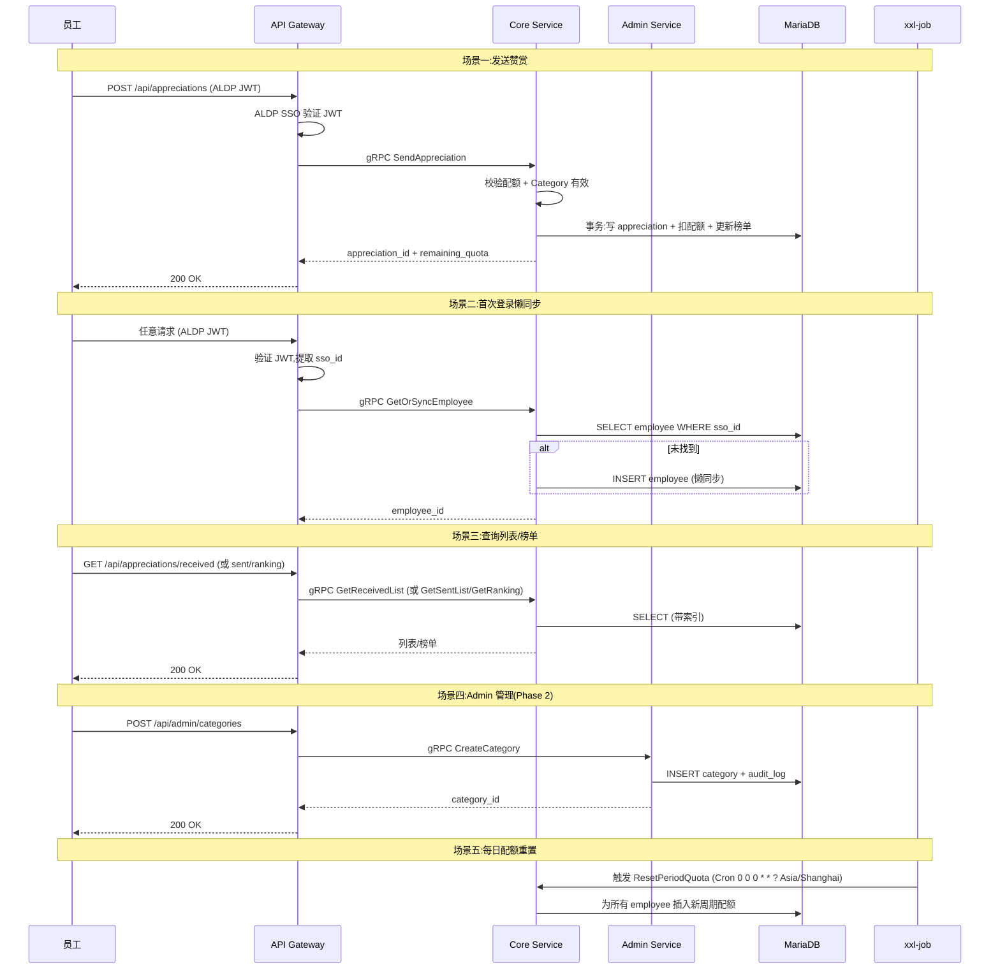
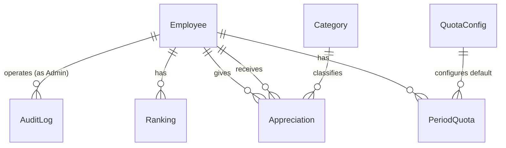

**项目名称**：C-Star 员工赞赏平台
**文档类型**：High Level Design — 项目级
**创建日期**：2026-07-28
**创建人**：ts-shiwu.wang
**审核人**：待定
**版本号**：v1.0
**状态**：草稿

| 版本号 | 修订日期 | 修订人 | 修订内容 | 审核人 |
|--------|----------|--------|----------|--------|
| v1.0 | 2026-07-28 | ts-shiwu.wang | 初稿创建 | 待定 |

---
## 1. 概述

C-Star 是公司级员工赞赏平台,员工通过 SSO 登录后给其他员工发送 Red Flower 作为赞赏,被赞赏者积累 Red Flower 进入本周期榜和全时期榜。所有记录对全员公开、不可变、配额制。

**关键约束**(来自 PRD + ADR,不可改):
- ADR-0001: 配额按 Red Flower 计数,不按 act 数
- ADR-0002: 单次 Appreciation 可送 1-N 个 Red Flower
- ADR-0003: 记录全公开,无退出选项,不可变
- ADR-0004: SSO 登录懒同步,首次登录才创建本地员工记录
- ADR-0005: 默认周期=每日,00:00 北京时间重置,不结转
- ADR-0006: 不维护离职状态,记录原样保留

**技术栈**(来自 architecture/):
- 后端框架:Micronaut
- 构建工具:Gradle
- 数据访问:Micronaut Data JDBC(@JdbcRepository)
- 数据库:MariaDB(每服务独立 schema)
- 服务间通信:gRPC
- 定时任务:xxl-job
- 部署:Kubernetes
- SSO:公司 ALDP
- 前端:待定

## 2. 处理流程图

## 3. 数据模型

| 实体 | 说明 | 所属服务 | 关键字段 | 关系 |
|---|---|---|---|---|
| Employee | 员工记录。首次 SSO 登录懒同步创建(ADR-0004),只存 sso_id + name,不维护离职状态(ADR-0006) | core | id, sso_id, name, created_at | 1:N Appreciation (作为 Giver), 1:N Appreciation (作为 Receiver), 1:N PeriodQuota, 1:N Ranking |
| Appreciation | 赞赏记录。记录谁给谁送了多少 Red Flower + Message + Category,写入后不可变(ADR-0003),全公开(ADR-0003) | core | id, giver_id, receiver_id, flowers, message, category_id, created_at | N:1 Employee (Giver), N:1 Employee (Receiver), N:1 Category |
| PeriodQuota | 周期配额。记录每个员工每个周期的配额使用情况,每日 00:00 北京时间重置(ADR-0005),不结转 | core | id, employee_id, period_date, flowers_used, flowers_total | N:1 Employee |
| Ranking | 榜单。维护本周期榜(period_date = 当天)和全时期榜(period_date = NULL)的累计 Red Flower 数,读优化 | core | id, employee_id, period_date (NULL=全时期), total_flowers | N:1 Employee |
| Category | 赞赏分类。5 个预设(Teamwork / Excellence / Innovation / Customer Focus / Going Above & Beyond),Phase 2 Admin 可运行时增删,退役是软删除不删历史 | admin | id, name, status (active/retired), created_at | 1:N Appreciation |
| QuotaConfig | 配额配置。存默认配额值和周期长度,Phase 2 Admin 可改 | admin | id, default_quota, period_length, updated_at | 无 |
| AuditLog | 审计日志。记录 Admin 的所有操作(谁、什么时候、改了什么),供 Admin 审计统计查询 | admin | id, admin_id, action, detail, created_at | N:1 Employee (Admin) |

**实体关系图**:

## 4. 接口设计

### 4.1 API Gateway(对外 REST)

| 方法 | 端点 | 说明 |
|---|---|---|
| POST | /api/appreciations | 发送赞赏 |
| GET | /api/appreciations/received | 我收到的赞赏列表 |
| GET | /api/appreciations/sent | 我发出的赞赏列表 |
| GET | /api/ranking/period | 本周期榜 |
| GET | /api/ranking/all-time | 全时期榜 |
| GET | /api/admin/categories | Category 列表 |
| POST | /api/admin/categories | 创建 Category |
| POST | /api/admin/categories/{id}/retire | 退役 Category |
| PUT | /api/admin/quota | 更新默认配额 |

### 4.2 Core Service(对内 gRPC)

| gRPC 方法 | 消费 | 说明 |
|---|---|---|
| SendAppreciation | MariaDB (core schema) | 发送赞赏 |
| GetReceivedList | MariaDB (core schema) | 收到的赞赏 |
| GetSentList | MariaDB (core schema) | 发出的赞赏 |
| GetRanking(period) | MariaDB (core schema) | 本周期榜 |
| GetRankingAllTime | MariaDB (core schema) | 全时期榜 |
| CheckQuota | MariaDB (core schema) | 配额查询 |
| GetOrSyncEmployee | MariaDB (core schema) | 获取/懒同步员工 |
| ResetPeriodQuota | MariaDB (core schema) | 每日配额重置 |

### 4.3 Admin Service(对内 gRPC)

| gRPC 方法 | 消费 | 说明 |
|---|---|---|
| CreateCategory | MariaDB (admin schema) | 创建 Category |
| RetireCategory | MariaDB (admin schema) | 退役 Category |
| UpdateDefaultQuota | MariaDB (admin schema) | 更新默认配额 |
| GetAuditStats | MariaDB (admin schema) | 审计统计查询 |
