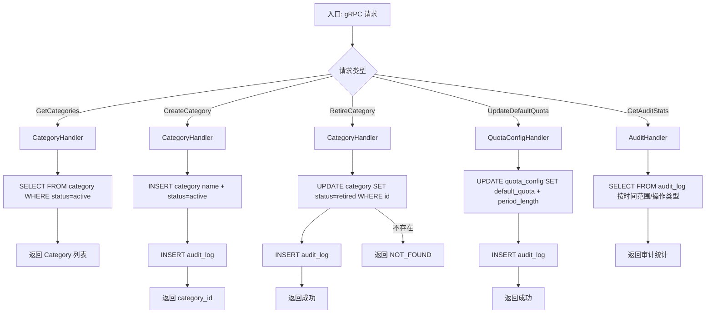

**项目名称**：C-Star 员工赞赏平台
**文档类型**：High Level Design — 服务级
**创建日期**：2026-07-28
**创建人**：ts-shiwu.wang
**审核人**：待定
**版本号**：v1.0
**状态**：草稿

| 版本号 | 修订日期 | 修订人 | 修订内容 | 审核人 |
|--------|----------|--------|----------|--------|
| v1.0 | 2026-07-28 | ts-shiwu.wang | 初稿创建 | 待定 |

---

## 1. 概述

Admin Service 负责 C-Star 的管理功能:Category CRUD(运行时增删,退役软删除)、配额配置、审计统计。所有管理数据存储在独立的 admin schema。Phase 2 才启用,Phase 1 用预设数据。

**所属项目级 HLD**：CS_HLD_PROJECT_v1.0_20260728.md

**服务边界**:
- 对外暴露:gRPC(只对 API Gateway,且需 Admin 角色校验)
- 对内消费:MariaDB(admin schema)

## 2. 处理流程图



## 3. 数据模型

### 表:category

赞赏分类。5 个预设(Teamwork / Excellence / Innovation / Customer Focus / Going Above & Beyond),Phase 2 Admin 可运行时增删,退役是软删除不删历史。

| 字段 | 类型 | 约束 | 说明 |
|---|---|---|---|
| id | BIGINT | PK, AUTO_INCREMENT | |
| name | VARCHAR(64) | NOT NULL | 分类名称 |
| status | ENUM('active', 'retired') | NOT NULL, DEFAULT 'active' | 退役=软删除 |
| created_at | DATETIME | NOT NULL, DEFAULT NOW | |

**索引**:idx_status (status)

### 表:quota_config

配额配置。存默认配额值和周期长度,Phase 2 Admin 可改。

| 字段 | 类型 | 约束 | 说明 |
|---|---|---|---|
| id | BIGINT | PK, AUTO_INCREMENT | |
| default_quota | INT | NOT NULL | 默认每周期配额(Red Flower 数) |
| period_length | ENUM('daily', 'weekly', 'monthly') | NOT NULL, DEFAULT 'daily' | 周期长度(ADR-0005) |
| updated_at | DATETIME | NOT NULL, DEFAULT NOW ON UPDATE NOW | |

### 表:audit_log

审计日志。记录 Admin 的所有操作(谁、什么时候、改了什么),供 Admin 审计统计查询。

| 字段 | 类型 | 约束 | 说明 |
|---|---|---|---|
| id | BIGINT | PK, AUTO_INCREMENT | |
| admin_id | BIGINT | NOT NULL | 操作者 employee_id |
| action | VARCHAR(64) | NOT NULL | 操作类型(create_category/retire_category/update_quota) |
| detail | TEXT | NULL | 操作详情(JSON) |
| created_at | DATETIME | NOT NULL, DEFAULT NOW | |

**索引**:idx_admin_created (admin_id, created_at), idx_action_created (action, created_at)

## 4. 接口设计

### 4.1 对外暴露(gRPC)

| gRPC 方法 | 说明 |
|---|---|
| GetCategories | 查询所有 active Category(供前端下拉 + Core 校验) |
| CreateCategory | 创建新 Category(Phase 2) |
| RetireCategory | 退役 Category(软删除,不删历史) |
| UpdateDefaultQuota | 更新默认配额值和周期长度(Phase 2) |
| GetAuditStats | 审计统计查询(按时间/操作类型聚合) |

### 4.2 对内消费

| 目标 | 说明 |
|---|---|
| MariaDB (admin schema) | category / quota_config / audit_log 读写 |

### 4.3 关键 gRPC 签名

```protobuf
service AdminService {
  rpc GetCategories(GetCategoriesRequest) returns (GetCategoriesResponse);
  rpc CreateCategory(CreateCategoryRequest) returns (CreateCategoryResponse);
  rpc RetireCategory(RetireCategoryRequest) returns (RetireCategoryResponse);
  rpc UpdateDefaultQuota(UpdateDefaultQuotaRequest) returns (UpdateDefaultQuotaResponse);
  rpc GetAuditStats(GetAuditStatsRequest) returns (GetAuditStatsResponse);
}

message CreateCategoryRequest {
  string name = 1;
}

message CreateCategoryResponse {
  int64 category_id = 1;
}

message RetireCategoryRequest {
  int64 category_id = 1;
}

message UpdateDefaultQuotaRequest {
  int32 default_quota = 1;
  string period_length = 2;  // daily / weekly / monthly
}

message GetAuditStatsRequest {
  string start_date = 1;  // YYYY-MM-DD
  string end_date = 2;
}

message GetAuditStatsResponse {
  repeated AuditStat stats = 1;
}

message AuditStat {
  string action = 1;
  int32 count = 2;
}
```
