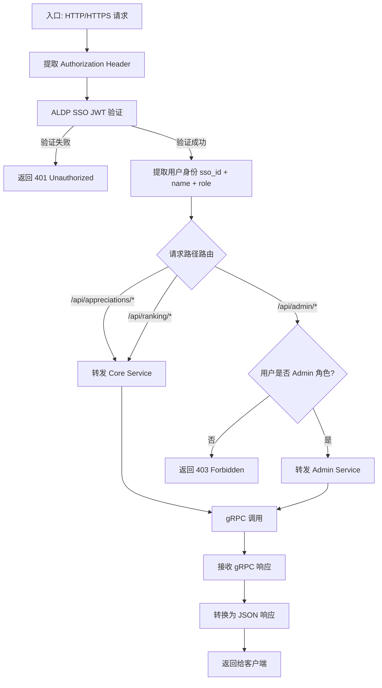

**项目名称**：C-Star 员工赞赏平台
**文档类型**：High Level Design — 服务级
**创建日期**：2026-07-28
**创建人**：ts-shiwu.wang
**审核人**：待定
**版本号**：v1.0
**状态**：草稿

| 版本号 | 修订日期 | 修订人 | 修订内容 | 审核人 |
|--------|----------|--------|----------|--------|
| v1.0 | 2026-07-28 | ts-shiwu.wang | 初稿创建 | 待定 |

---

## 1. 概述

API Gateway 是 C-Star 的外部请求统一入口,负责 ALDP SSO 验证和请求路由,不做业务逻辑,不持久化数据。

**所属项目级 HLD**：CS_HLD_PROJECT_v1.0_20260728.md

**服务边界**:
- 对外暴露:REST API(用户/浏览器友好)
- 对内消费:gRPC → Core Service、Admin Service

## 2. 处理流程图

## 3. 数据模型

API Gateway 不持有业务数据,无独立 schema。

仅维护运行时配置(从 K8s ConfigMap 或 Consul 读取):

| 配置项 | 说明 |
|---|---|
| aldp.jwks.url | ALDP JWT 验证的公钥地址 |
| grpc.core-service.target | Core Service gRPC 地址 |
| grpc.admin-service.target | Admin Service gRPC 地址 |
| server.port | HTTP 监听端口(默认 8080) |

## 4. 接口设计

### 4.1 对外暴露(REST)

| 方法 | 端点 | 说明 | 转发目标 |
|---|---|---|---|
| POST | /api/appreciations | 发送赞赏 | Core: SendAppreciation |
| GET | /api/appreciations/received | 我收到的赞赏列表 | Core: GetReceivedList |
| GET | /api/appreciations/sent | 我发出的赞赏列表 | Core: GetSentList |
| GET | /api/ranking/period | 本周期榜 | Core: GetRanking(period) |
| GET | /api/ranking/all-time | 全时期榜 | Core: GetRankingAllTime |
| GET | /api/admin/categories | Category 列表 | Admin: GetCategories |
| POST | /api/admin/categories | 创建 Category | Admin: CreateCategory |
| POST | /api/admin/categories/{id}/retire | 退役 Category | Admin: RetireCategory |
| PUT | /api/admin/quota | 更新默认配额 | Admin: UpdateDefaultQuota |

### 4.2 对内消费(gRPC 客户端)

Gateway 作为 gRPC 客户端调用后端服务,消费以下 gRPC 方法:

| 目标服务 | gRPC 方法 | 说明 |
|---|---|---|
| Core Service | SendAppreciation | 发送赞赏 |
| Core Service | GetReceivedList | 收到的赞赏 |
| Core Service | GetSentList | 发出的赞赏 |
| Core Service | GetRanking(period) | 本周期榜 |
| Core Service | GetRankingAllTime | 全时期榜 |
| Core Service | GetOrSyncEmployee | 获取/懒同步员工 |
| Admin Service | GetCategories | Category 列表 |
| Admin Service | CreateCategory | 创建 Category |
| Admin Service | RetireCategory | 退役 Category |
| Admin Service | UpdateDefaultQuota | 更新默认配额 |
| Admin Service | GetAuditStats | 审计统计 |
