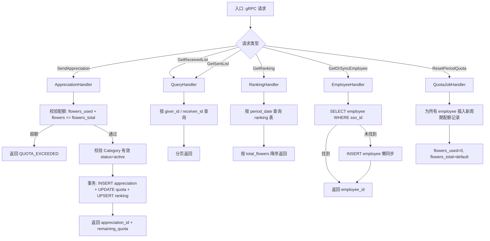

**项目名称**：C-Star 员工赞赏平台
**文档类型**：High Level Design — 服务级
**创建日期**：2026-07-28
**创建人**：ts-shiwu.wang
**审核人**：待定
**版本号**：v1.0
**状态**：草稿

| 版本号 | 修订日期 | 修订人 | 修订内容 | 审核人 |
|--------|----------|--------|----------|--------|
| v1.0 | 2026-07-28 | ts-shiwu.wang | 初稿创建 | 待定 |

---

## 1. 概述

Core Service 是 C-Star 的核心业务服务,负责赞赏主流程:发送赞赏、收发列表、双榜查询、配额管理、员工懒同步。所有赞赏相关数据存储在独立的 core schema。

**所属项目级 HLD**：CS_HLD_PROJECT_v1.0_20260728.md

**服务边界**:
- 对外暴露:gRPC(只对 API Gateway)
- 对内消费:MariaDB(core schema)

## 2. 处理流程图



## 3. 数据模型

### 表:employee

员工记录。首次 SSO 登录懒同步创建(ADR-0004),只存 sso_id + name,不维护离职状态(ADR-0006)。

| 字段 | 类型 | 约束 | 说明 |
|---|---|---|---|
| id | BIGINT | PK, AUTO_INCREMENT | 员工内部 ID |
| sso_id | VARCHAR(128) | NOT NULL, UNIQUE | ALDP SSO 唯一标识 |
| name | VARCHAR(128) | NOT NULL | 员工姓名 |
| created_at | DATETIME | NOT NULL, DEFAULT NOW | 首次登录时间 |

**索引**:uk_sso_id (sso_id)

### 表:appreciation

赞赏记录。记录谁给谁送了多少 Red Flower + Message + Category,写入后不可变(ADR-0003),全公开(ADR-0003)。

| 字段 | 类型 | 约束 | 说明 |
|---|---|---|---|
| id | BIGINT | PK, AUTO_INCREMENT | |
| giver_id | BIGINT | FK → employee.id, NOT NULL | 发送者 |
| receiver_id | BIGINT | FK → employee.id, NOT NULL | 接收者 |
| flowers | INT | NOT NULL, CHECK (flowers >= 1) | Red Flower 数量(ADR-0002) |
| message | TEXT | NOT NULL | 赞赏留言 |
| category_id | BIGINT | NOT NULL | 分类 ID(引用 admin schema) |
| created_at | DATETIME | NOT NULL, DEFAULT NOW | 不可变,创建后不改 |

**索引**:idx_giver_created (giver_id, created_at), idx_receiver_created (receiver_id, created_at)

**注意**:无 UPDATE / DELETE 接口,保证不可变(ADR-0003)

### 表:period_quota

周期配额。记录每个员工每个周期的配额使用情况,每日 00:00 北京时间重置(ADR-0005),不结转。

| 字段 | 类型 | 约束 | 说明 |
|---|---|---|---|
| id | BIGINT | PK, AUTO_INCREMENT | |
| employee_id | BIGINT | FK → employee.id, NOT NULL | |
| period_date | DATE | NOT NULL | 周期日期(默认每天) |
| flowers_used | INT | NOT NULL, DEFAULT 0 | 已用配额 |
| flowers_total | INT | NOT NULL | 本周期总配额 |

**索引**:uk_emp_period (employee_id, period_date)

### 表:ranking

榜单。维护本周期榜(period_date = 当天)和全时期榜(period_date = NULL)的累计 Red Flower 数,读优化。

| 字段 | 类型 | 约束 | 说明 |
|---|---|---|---|
| id | BIGINT | PK, AUTO_INCREMENT | |
| employee_id | BIGINT | FK → employee.id, NOT NULL | |
| period_date | DATE | NULL | NULL = 全时期榜;非 NULL = 本周期榜 |
| total_flowers | INT | NOT NULL, DEFAULT 0 | 累计 Red Flower 数 |

**索引**:uk_emp_period (employee_id, period_date), idx_period_flowers (period_date, total_flowers DESC)

## 4. 接口设计

### 4.1 对外暴露(gRPC)

| gRPC 方法 | 说明 |
|---|---|
| SendAppreciation | 发送赞赏(校验配额 + 写入 + 扣配额 + 更新榜单) |
| GetReceivedList | 查询我收到的赞赏列表(分页) |
| GetSentList | 查询我发出的赞赏列表(分页) |
| GetRanking(period) | 查询本周期榜 |
| GetRankingAllTime | 查询全时期榜 |
| CheckQuota | 查询当前周期剩余配额 |
| GetOrSyncEmployee | 获取/懒同步员工记录(ADR-0004) |
| ResetPeriodQuota | 每日配额重置(ADR-0005,xxl-job 触发) |

### 4.2 对内消费

| 目标 | 说明 |
|---|---|
| MariaDB (core schema) | 员工/赞赏/配额/榜单 读写 |
| Admin Service (gRPC) | 查询 Category 有效性(SendAppreciation 时校验 category_id 对应的 status=active) |

### 4.3 关键 gRPC 签名

```protobuf
service CoreService {
  rpc SendAppreciation(SendAppreciationRequest) returns (SendAppreciationResponse);
  rpc GetReceivedList(GetReceivedListRequest) returns (GetReceivedListResponse);
  rpc GetSentList(GetSentListRequest) returns (GetSentListResponse);
  rpc GetRanking(GetRankingRequest) returns (GetRankingResponse);
  rpc GetRankingAllTime(GetRankingAllTimeRequest) returns (GetRankingResponse);
  rpc CheckQuota(CheckQuotaRequest) returns (CheckQuotaResponse);
  rpc GetOrSyncEmployee(GetOrSyncEmployeeRequest) returns (GetOrSyncEmployeeResponse);
  rpc ResetPeriodQuota(ResetPeriodQuotaRequest) returns (ResetPeriodQuotaResponse);
}

message SendAppreciationRequest {
  int64 giver_id = 1;
  int64 receiver_id = 2;
  int32 flowers = 3;
  string message = 4;
  int64 category_id = 5;
}

message SendAppreciationResponse {
  int64 appreciation_id = 1;
  int32 remaining_quota = 2;
}

message CheckQuotaRequest {
  int64 employee_id = 1;
}

message CheckQuotaResponse {
  int32 flowers_used = 1;
  int32 flowers_total = 2;
  int32 remaining = 3;
}
```
