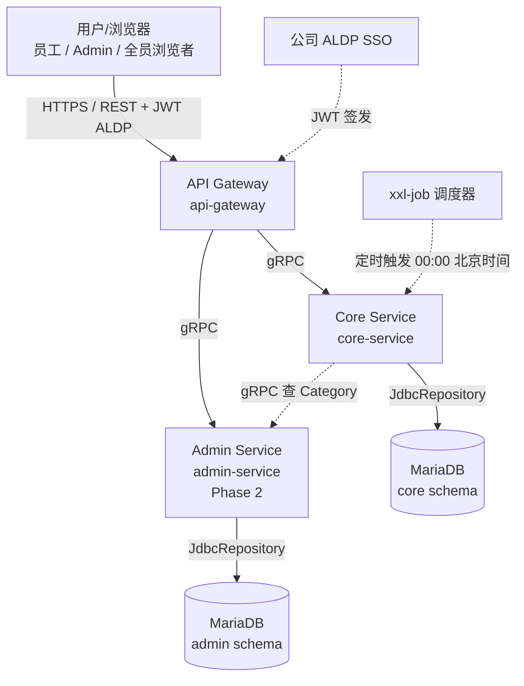
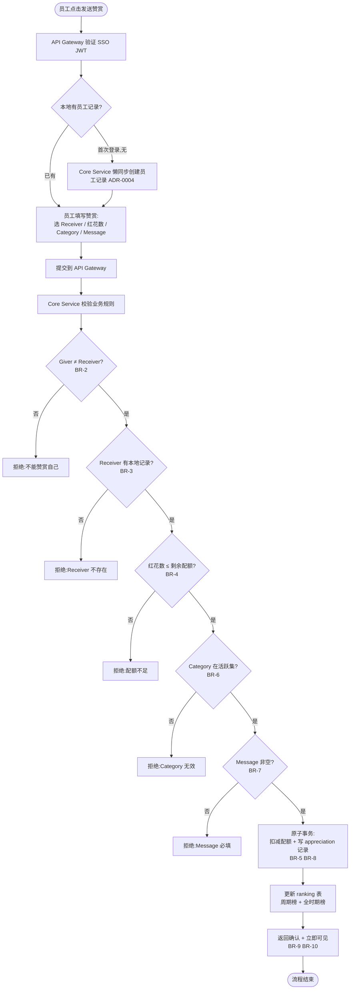
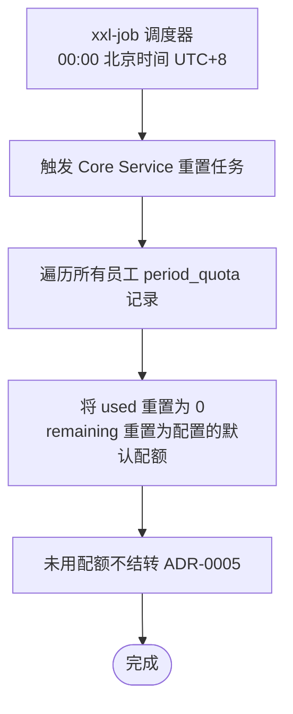

**项目名称**:C-Star
**文档类型**:High Level Design(项目级)
**创建日期**:2026-08-05
**创建人**:ts-shiwu.wang
**审核人**:ts-shiwu.wang
**版本号**:v1.0
**状态**:草稿

| 版本号 | 修订日期 | 修订人 | 修订内容 | 审核人 |
|--------|----------|--------|----------|--------|
| v1.0 | 2026-08-05 | ts-shiwu.wang | 初稿创建 | ts-shiwu.wang |

---

## 1. 项目概述

C-Star 是公司级员工赞赏平台。任何员工可以正式认可另一位员工的工作,被认可者获得"红花"(Red Flower),红花累积形成公司级双榜(周期榜 + 全时期榜)。所有赞赏记录全公司公开,使认可具有真实的社会份量。

产品刻意保持极简:无团队、无层级、无通知、无私有模式。简洁即价值——认可成为日常习惯,而非季度仪式。

**业务背景**:

公司缺乏一个轻量、公开的员工间认可渠道。传统表彰机制偏重管理者自上而下的季度/年度评选,流程重、频次低、参与面窄。C-Star 让每个员工在几秒内就能对同事说"我看到了你做的事,它很重要",并把认可沉淀为可见的红花记录与排行榜,让日常认可成为公司文化的一部分。

**面向谁**:

| 角色 | 关系 |
|---|---|
| Employee(员工) | 产品的核心。SSO 登录,发赞赏、收红花、浏览记录、查榜单。每个员工从第一天起就能当 Giver;首次登录后才可被选为 Receiver |
| Admin(管理员) | Phase 2 引入的特权员工,可运行时管理 Category 集合、改配额配置、查审计统计 |

**关键约束**(来自 PRD + ADR,不可改):

- **ADR-0001**:Period Quota 按红花数计量(不是按赞赏次数)。单次赞赏可消耗 1~N 朵
- **ADR-0002**:单次赞赏可携带 1~N 朵红花,N 受 Giver 剩余配额上限
- **ADR-0003**:所有 Appreciation 记录全公司公开,无 opt-out,无隐私分级;记录不可变(创建后不可编辑、不可撤销)
- **ADR-0004**:员工记录在首次 SSO 登录时懒同步创建到本地 DB,不预加载全量员工目录;只有存在本地记录的员工可被选为 Receiver
- **ADR-0005**:默认周期为每日,00:00 中国时间(UTC+8)重置;周期长度可按部署配置;未用配额不结转
- **ADR-0006**:不维护离职状态、不与 HR 同步离职、不清理离职员工记录;离职员工的历史记录与全时期榜位永久保留
- **ADR-0007**:前端选型 Vue 3 + Element Plus

**本次 HLD 覆盖范围(Phase 1 MVP)**:

SSO 登录懒同步、发送/接收赞赏、收发列表、公司级记录浏览、双榜(周期+全时期)、每日配额重置(00:00 北京时间)、5 个预设 Category、配置文件驱动设置。

Phase 2(Admin 角色、Category 运行时增删、配额/周期运行时调整、审计统计)不在本次 HLD 范围,后续独立 HLD。

---

## 2. 整体架构图

**图例说明**:

- 实线 = 同步调用(REST / gRPC / JDBC)
- 虚线 = 异步/定时触发或外部依赖
- 用户 → API Gateway 走 HTTPS REST(对用户友好,前端 SPA 调用)
- Gateway → Core/Admin 走 gRPC(类型安全,内部调用)
- Core/Admin 各自独立 MariaDB schema,不跨库查表;需要对方数据走 gRPC

**服务全景**:

| 服务 | 对外协议 | 对内协议 | 数据库 |
|---|---|---|---|
| api-gateway | REST(用户友好) | gRPC → core / admin | 无独立 schema |
| core-service | gRPC(只对 gateway) | Micronaut Data JDBC → MariaDB | core schema |
| admin-service | gRPC(只对 gateway) | Micronaut Data JDBC → MariaDB | admin schema |

---

## 3. 业务流程概览

### 3.1 发送赞赏(核心主流程)

**流程说明**:

1. **登录与懒同步**:员工经 SSO 登录,API Gateway 验证 JWT;Core Service 在首次登录时懒同步创建本地 employee 记录(ADR-0004),此后才可被选为 Receiver
2. **填写赞赏**:Giver 选 Receiver(单选)、红花数(1~剩余配额)、Category(从活跃集)、Message(非空)
3. **校验**:Core Service 校验 6 条业务规则(BR-2/3/4/6/7 + BR-8 不可变),任一失败即拒绝
4. **原子事务**:扣减 Giver 配额 + 写 appreciation 记录必须在同一事务内,保证"配额花掉必有记录、有记录必扣配额"的一致性(AC-G6)
5. **更新榜单**:同步更新周期榜(当天 period_date)与全时期榜(period_date = NULL)
6. **即时生效**:无 accept 步骤(BR-10),记录立即全公司可见(BR-9)、不可改(BR-8)

### 3.2 每日配额重置(batch)

**流程说明**:

- xxl-job 按 cron 在 00:00 北京时间触发(ADR-0005),Core Service 把所有员工的 period_quota 重置为默认配额,未用部分不结转(BR-13)
- 周期长度可按部署配置;默认每日

---

## 4. 服务清单与定位

### 4.1 api-gateway

| 维度 | 说明 |
|---|---|
| 服务名 | api-gateway |
| 核心职责 | SSO JWT 验证 + 把前端 REST 请求路由到后端 gRPC 服务(core/admin) |
| 上游调用方 | 前端 SPA(用户/浏览器) |
| 下游依赖 | core-service(gRPC)、admin-service(gRPC,Phase 2) |
| 入口类型 | api |

**入口类型说明**:

- **API 入口**:接收前端 REST 请求,验证 ALDP SSO JWT,把请求转成 gRPC 调 core/admin,聚合响应返回前端。详细设计见 `CS_design_api_api-gateway_v1.0_*.md`

### 4.2 core-service

| 维度 | 说明 |
|---|---|
| 服务名 | core-service |
| 核心职责 | 赞赏主流程:发送赞赏(校验+扣配额+写记录+更榜)、收发列表查询、双榜查询、配额查询/重置 |
| 上游调用方 | api-gateway(gRPC)、xxl-job(定时触发) |
| 下游依赖 | MariaDB(core schema)、admin-service(gRPC,查 Category 活跃集) |
| 入口类型 | api + batch |

**入口类型说明**:

- **API 入口**:同步请求/响应,处理发送赞赏、查 Received/Sent List、查双榜、查剩余配额。详细设计见 `CS_design_api_core-service_v1.0_*.md`
- **Batch 入口**:定时批处理,每日 00:00 北京时间由 xxl-job 触发,重置所有员工的 period_quota 到默认配额。详细设计见 `CS_design_batch_core-service_v1.0_*.md`

**core schema 关键表**:

| 表 | 用途 |
|---|---|
| employee | 员工记录,首次 SSO 登录时懒同步创建(ADR-0004),只存 sso_id + name,不维护离职状态(ADR-0006) |
| appreciation | 赞赏记录,谁给谁送多少红花 + Message + Category,写入后不可变(ADR-0003),全公开 |
| period_quota | 周期配额,每员工每周期配额使用,每日 00:00 北京时间重置(ADR-0005),不结转 |
| ranking | 榜单,周期榜(period_date = 当天)+ 全时期榜(period_date = NULL)的累计红花数,读优化 |

### 4.3 admin-service(Phase 2)

| 维度 | 说明 |
|---|---|
| 服务名 | admin-service |
| 核心职责 | 管理功能:Category CRUD(运行时增删)、配额配置、审计统计 |
| 上游调用方 | api-gateway(gRPC) |
| 下游依赖 | MariaDB(admin schema) |
| 入口类型 | api(Phase 2 启用) |

**入口类型说明**:

- **API 入口**:同步请求/响应,处理 Category 增删、配额配置修改、审计统计查询。Phase 2 启用,详细设计见后续独立 HLD/Design

> Phase 1 阶段:5 个预设 Category(Teamwork / Excellence / Innovation / Customer Focus / Going Above & Beyond)以配置文件驱动,admin-service 不提供运行时 API。core-service 通过 gRPC 调 admin-service 读 Category 活跃集(或 Phase 1 直接读配置文件)。

**admin schema 关键表**(Phase 2):

| 表 | 用途 |
|---|---|
| category | 赞赏分类,5 个预设,Phase 2 Admin 可运行时增删,退役是软删除不删历史(BR-14) |
| quota_config | 配额配置,存默认配额值和周期长度,Phase 2 Admin 可改 |
| audit_log | 审计日志,记录 Admin 的所有操作,供审计统计查询 |

---

> **下一步**:HLD 已完成。是否需要生成某服务的 Design 文档(api/batch/worker)?如需,请指定服务+类型,例如"core-service 的 api + batch"。是否需要 glossary.md?(项目已有 CONTEXT.md,若无新术语建议跳过)
