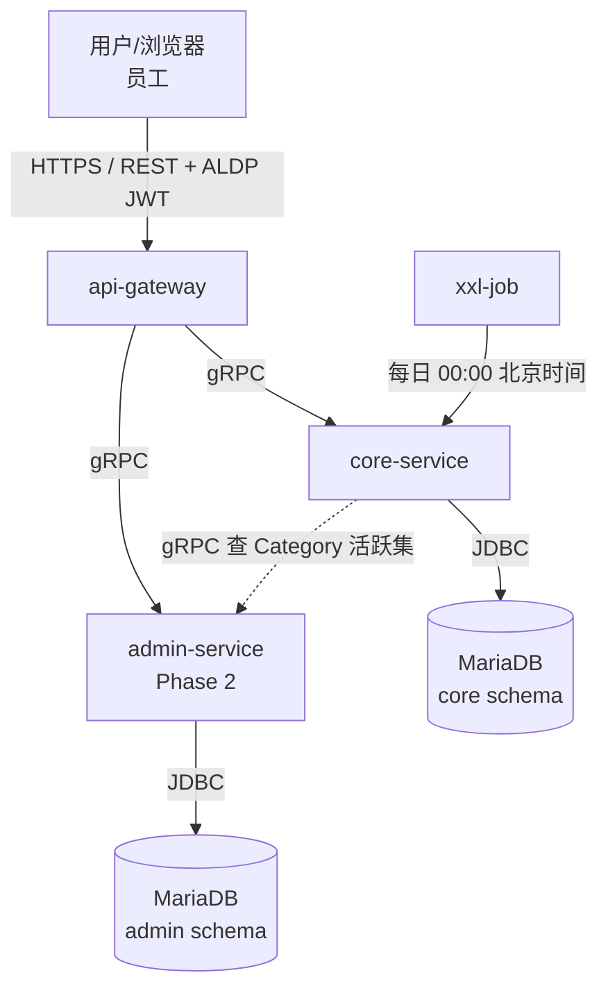
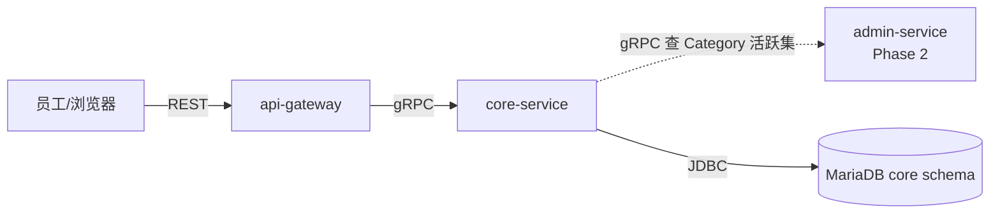

**项目名称**：C-Star
**文档类型**：High Level Design（项目级）
**创建日期**：2026-08-11
**创建人**：ts-shiwu.wang
**审核人**：ts-shiwu.wang
**版本号**：v1.0
**状态**：草稿

| 版本号 | 修订日期 | 修订人 | 修订内容 | 审核人 |
|--------|----------|--------|----------|--------|
| v1.0 | 2026-08-11 | ts-shiwu.wang | 初稿创建 | ts-shiwu.wang |

---

> **本文档上游**：系统设计见 `feature/system-design/c-star-system-design.md`（技术选型 / 服务职责 / DB schema 的权威来源）。
> **本文档下游**：详细设计见 `feature/detail-design/<ticket>-*.md`（字段级 DDL / proto / 错误码 / 校验规则 / 测试由 detail-designer 产出）。

## 1. 项目概述

C-Star 是公司级员工赞赏平台。任何员工可以正式认可另一位员工的工作或行为，被认可者获得"红花"（Red Flower）；所有赞赏记录与排名全公司公开，使认可具有真实的社会分量。产品刻意保持极简：无团队、无层级、无通知、无私有模式——让认可成为日常习惯。

**业务背景**：
公司缺乏一个轻量、公开的员工间认可渠道。传统表彰机制偏重管理者自上而下的季度/年度评选，流程重、频次低、参与面窄。C-Star 让每个员工在几秒内就能对同事说"我看到了你做的事，它很重要"，并把认可沉淀为可见的红花记录与排行榜，累积驱动公司级双榜（周期榜 + 全时期榜）。

**关键约束**（来自 PRD + ADR，不可改）：
- **ADR-0001**：Period Quota 按红花数计量（非按赞赏次数）。
- **ADR-0005**：默认周期每日，00:00 中国时间（UTC+8）重置；周期长度可配置；未用配额不结转。
- **ADR-0004**：员工首次 SSO 登录才懒同步创建本地记录，之后才能被选为 Receiver；不预加载全员。
- **ADR-0003**：记录不可变 + 全公司公开，任何 actor 不能改、不能设私有。
- **ADR-0006**：不维护离职状态；离职者历史记录与全时期榜位永久保留。
- **Eureka 技术栈**：后端基于公司 Eureka 项目（Micronaut 栈）统一脚手架（见 system-design §2）。

**本次 HLD 覆盖范围（Phase 1 MVP）**：
SSO 登录懒同步、发送/接收赞赏、收发列表、全公司记录浏览、双榜（周期 + 全时期）、每日配额重置、5 个预设 Category、配置文件驱动设置。Phase 2（Admin 角色、运行时删 Category、配额/周期运行时调整、审计统计）不在本次范围。

## 2. 整体架构图

基于 `system-design §3`（服务全景），裁剪到 Phase 1 涉及的服务与调用关系：

**图例说明**：
- 实线 = 同步调用（REST / gRPC / JDBC）
- 虚线 = 定时触发（调度器）或跨服务查询
- 技术栈：Micronaut（基于 Eureka）+ Micronaut Data JDBC + MariaDB + gRPC，部署 Kubernetes（详见 system-design §2/§4）

## 3. 业务流程概览

> **本节定位**：告诉读者 Phase 1 涉及哪些接口/任务，各一句话说干啥。
> **不做**：不列具体校验规则、不画校验分支、不写错误码——那些是 detail-design 的活。

### 3.1 Phase 1 涉及的接口 / 任务清单

| # | 名称 | 类型 | 所属服务 | 一句话说明 | 详细设计 |
|---|---|---|---|---|---|
| 1 | SSO 登录与员工懒同步 | api | core-service | 员工经 ALDP SSO 登录 → Gateway 验 JWT → Core 首次登录懒同步创建 employee 记录（ADR-0004） | `feature/detail-design/9527-*.md` |
| 2 | 发送赞赏 | api | core-service | Giver 提交（Receiver + 红花数 + Category + Message）→ 业务校验 → 原子事务（扣配额 + 写 appreciation + 更 ranking）→ 返回确认，记录立即公开可见 | `feature/detail-design/9527-*.md` |
| 3 | 查 Received List（我收到的） | api | core-service | 查"我是 Receiver"的所有记录，按时间倒序返回；无推送，主动浏览 | `feature/detail-design/9527-*.md` |
| 4 | 查 Sent List + 剩余配额 | api | core-service | 查"我是 Giver"的所有记录 + 当前周期剩余配额 | `feature/detail-design/9527-*.md` |
| 5 | 浏览全公司记录 | api | core-service | 全公司公开记录浏览，可看每条 Giver/Receiver/时间/Message/Category，翻页 | `feature/detail-design/9527-*.md` |
| 6 | 查双榜 | api | core-service | 返回周期榜（当日累计红花）+ 全时期榜（含离职） | `feature/detail-design/9527-*.md` |
| 7 | 每日配额重置 | batch | core-service | xxl-job 00:00 北京时间触发 → 全员 period_quota 重置为默认配额 → 未用不结转 | `feature/detail-design/9527-*.md` |

> 说明：api-gateway 仅做 JWT 验证 + REST↔gRPC 转换 + 路由，无独立业务接口，不在上表单独列出。Admin 接口属 Phase 2。

### 3.2 跨服务编排图（极简）

> 上图仅体现"谁调谁、走什么协议"；校验、扣配额、写记录、更榜等内部处理在 core-service 内完成（详见对应 detail），不在 HLD 展开。流程图中不出现任何判断分支。

## 4. 服务清单与定位（Phase 1）

### 4.1 api-gateway

| 维度 | 说明 |
|---|---|
| 服务名 | api-gateway |
| 核心职责 | SSO JWT 验证 + 前端 REST 到后端 gRPC 路由 + 协议转换 |
| 上游调用方 | 前端 SPA（员工/浏览器） |
| 下游依赖 | core-service（gRPC）、admin-service（gRPC，Phase 2） |
| 入口类型 | api |

**入口类型说明**：

- **API 入口**：同步请求/响应，负责鉴权 + 路由，无独立业务逻辑。详细设计见 `feature/detail-design/9527-*.md`

### 4.2 core-service

| 维度 | 说明 |
|---|---|
| 服务名 | core-service |
| 核心职责 | 赞赏主链路：发送（扣配额/写记录/更双榜）、收发列表、全公司记录浏览、双榜查询、配额查询/每日重置、SSO 懒同步 |
| 上游调用方 | api-gateway（gRPC）、xxl-job（定时） |
| 下游依赖 | MariaDB（core schema）、admin-service（gRPC 查 Category 活跃集） |
| 入口类型 | api + batch |

**入口类型说明**：

- **API 入口**：同步请求/响应，即 §3.1 的 #1~#6。详细设计见 `feature/detail-design/9527-*.md`
- **Batch 入口**：定时批处理，即在 §3.1 表 #7 每日重置配额。详细设计见 `feature/detail-design/9527-*.md`

> 数据模型（实体 + 关键字段 + ER 图）与 DDL 归 detail design，不在 HLD 列出（见 system-design §5 的表用途概览）。

### 4.3 admin-service（Phase 2）

| 维度 | 说明 |
|---|---|
| 服务名 | admin-service |
| 核心职责 | 管理功能：Category CRUD、配额/周期配置、审计统计 |
| 上游调用方 | api-gateway（gRPC）、core-service（gRPC 查 Category 活跃集） |
| 下游依赖 | MariaDB（admin schema） |
| 入口类型 | api（Phase 2 启用） |

**入口类型说明**：

- **API 入口**：Phase 2 提供 Category 增删、配额配置修改、审计统计查询。详细设计见后续 detail-design

---

> **下一步**：本文档覆盖 Phase 1 全部接口/任务。需要 detail 时，为具体 ticket 调用 detail-designer（先确保 ticket 号 + system-design v1.0 就位）。