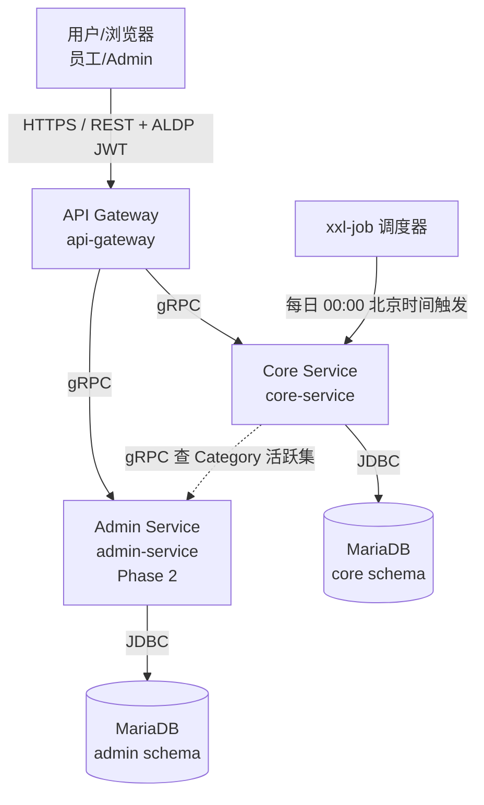

# C-Star 技术架构

> **状态**：草稿（待 review）
> **日期**：2026-08-11
> **基于**：C-Star PRD + 7 个 ADR
> **维护者**：ts-shiwu.wang
> **版本**：v1.0（由 system-designer skill 生成）

## 1. 概述

C-Star 是公司级员工赞赏平台。为支撑 PRD 描述的功能，采用微服务架构——3 个核心服务 + 1 个 API 网关，服务间 gRPC 通信，每服务独立数据库 schema，部署在 Kubernetes。

**业务背景**：
员工需要一个轻量、日常的认可渠道——几秒钟能完成一次赞赏，认可公开可见带有社交分量，红花累积驱动双榜（周期榜 + 全时期榜）。架构上要支撑：赞赏写入的原子性（配额 + 记录 + 榜单一致）、全员可见的高读可用、每日配额重置的时区正确性、记录永久不可变。

**架构风格**：
微服务架构，按业务域拆分（core 赞赏主链路 / admin 管理 / gateway 接入）。服务间 gRPC，Database-per-service，K8s 部署复用 ArgoCD GitOps。Phase 1 配置文件驱动设置，Phase 2 admin-service 提供运行时管理 API。

## 2. 技术选型

| 类别 | 选型 | 说明 | ADR |
|---|---|---|---|
| **后端框架** | Micronaut | 公司既有技术栈基线（Eureka 项目即 Micronaut 栈），直接复用其脚手架与约定 | 公司基线 |
| **构建工具** | Gradle | 多模块管理方便，Micronaut 官方推荐 | 公司基线 |
| **数据访问** | Micronaut Data JDBC（@JdbcRepository） | 轻量 Repository，编译期生成实现，比 JPA 简单 | 公司基线 |
| **数据库** | MariaDB | 成熟稳定，运维成本低 | 公司基线 |
| **服务间通信** | gRPC | 类型安全，Protobuf 契约，内部调用性能好 | 公司基线 |
| **部署** | Kubernetes | 跟现有项目一致，复用 ArgoCD GitOps 流程 | 公司基线 |
| **定时任务** | xxl-job | 可视化调度，内置失败重试，直接配 Cron + 时区不用换算 UTC | [ADR-0005](../docs/adr/0005-daily-reset-china-time.md) |
| **SSO / 鉴权** | 公司 ALDP | 复用公司单点登录，不自己实现认证 | [ADR-0004](../docs/adr/0004-sso-lazy-employee-sync.md) |
| **前端** | Vue 3 + Element Plus | 简单 CRUD 场景开箱即用，上手快 | [ADR-0007](../docs/adr/0007-frontend-vue3-element-plus.md) |

## 3. 架构图

**图例说明**：
- 实线 = 同步调用（REST / gRPC / JDBC）
- 虚线 = 跨服务 gRPC 调用（core 查 admin 的 Category 活跃集）+ 定时触发
- 调度器独立于服务拓扑，按 cron 触发 core-service 的 batch 入口

## 4. 服务职责

| 服务 | 职责 | 对外协议 | 对内协议 |
|---|---|---|---|
| API Gateway | SSO JWT 验证 + 请求路由 + 协议转换 | REST（用户友好） | gRPC → core / admin |
| Core Service | 赞赏主链路（发送/列表/榜单/配额）+ SSO 登录懒同步 | gRPC（只对 gateway） | JDBC → MariaDB / gRPC → admin（查 Category） |
| Admin Service | 管理功能（Category CRUD / 配额配置 / 审计统计，Phase 2） | gRPC（只对 gateway） | JDBC → MariaDB |

**服务划分依据**：
按业务域 + 变更频率拆分。core 承载赞赏主链路（高频写、强一致需求），admin 承载管理配置（低频写、Phase 2 才启用）。两者 schema 隔离，避免管理功能变更影响主链路稳定性。gateway 独立以统一 SSO 验证和协议转换，后端服务不重复实现鉴权。

## 5. 数据库划分

**原则**：Database-per-service——每服务独立 schema，服务间不跨库查表，需要对方数据走 gRPC。理由：避免服务间数据库耦合，独立演进，独立部署。

### 5.1 core schema

core-service 的数据库，承载赞赏主链路全部业务实体。

| 表 | 用途 |
|---|---|
| employee | 员工记录。首次 SSO 登录时懒同步创建（ADR-0004），只存 sso_id + name，不维护离职状态（ADR-0006） |
| appreciation | 赞赏记录。记录谁给谁送了多少 Red Flower + Message + Category，写入后不可变（ADR-0003），全公开（ADR-0003） |
| period_quota | 周期配额。记录每个员工每个周期的配额使用情况，每日 00:00 北京时间重置（ADR-0005），不结转 |
| ranking | 榜单读优化表。维护周期榜（period_date = 当天）和全时期榜（period_date = NULL）的累计 Red Flower 数 |

> 字段/索引/约束定义属 detail design，本表只列"表 + 一句话用途"。

### 5.2 admin schema

| 表 | 用途 |
|---|---|
| category | 赞赏分类。5 个预设（Teamwork / Excellence / Innovation / Customer Focus / Going Above & Beyond），Phase 2 Admin 可运行时增删，退役是软删除不删历史 |
| quota_config | 配额配置。存默认配额值和周期长度，Phase 2 Admin 可改 |
| audit_log | 审计日志。记录 Admin 的所有操作（谁、什么时候、改了什么），供 Admin 审计统计查询 |

## 6. 关键架构决策追溯

| 决策 | 选择 | ADR |
|---|---|---|
| 配额计量方式 | 按 Red Flower 数计量，不按赞赏次数 | [ADR-0001](../docs/adr/0001-quota-measured-in-red-flowers.md) |
| 单次赞赏红花数 | 1 到 N 朵，N 受剩余配额约束 | [ADR-0002](../docs/adr/0002-variable-red-flower-count-per-appreciation.md) |
| 记录可见性 | 全公司公开，无 opt-out | [ADR-0003](../docs/adr/0003-records-public-no-opt-out.md) |
| 记录不可变性 | 写入后不可编辑、不可撤销 | [ADR-0003](../docs/adr/0003-records-public-no-opt-out.md) |
| 员工记录创建时机 | 首次 SSO 登录懒同步，不预加载 | [ADR-0004](../docs/adr/0004-sso-lazy-employee-sync.md) |
| 配额重置周期 | 每日 00:00 北京时间（UTC+8），不结转 | [ADR-0005](../docs/adr/0005-daily-reset-china-time.md) |
| 离职处理 | 不维护离职状态，历史记录与全时期榜位永久保留 | [ADR-0006](../docs/adr/0006-no-active-departure-handling.md) |
| 前端选型 | Vue 3 + Element Plus | [ADR-0007](../docs/adr/0007-frontend-vue3-element-plus.md) |
| 服务拆分粒度 | 微服务，按业务域拆（core / admin / gateway） | 公司基线 |
| 数据库隔离策略 | Database-per-service | 公司基线 |
| 服务间通信 | gRPC，类型安全 | 公司基线 |

---

> **下游衔接**：本文档是 HLD 的强制上游。HLD（`<PROJECT>_HLD_*.md`）的"技术栈"小节应从本文档 §2 提取。
> 若架构变更，先更新本文档 → 再级联更新 HLD / detail design。